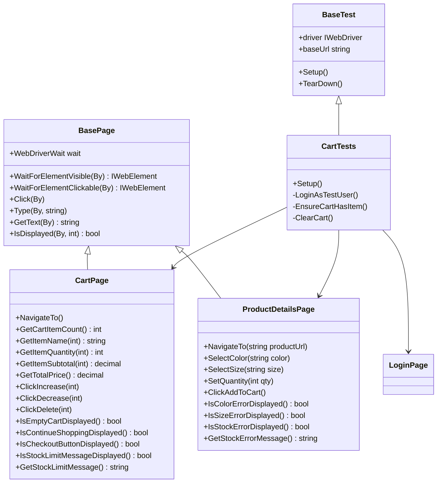

# Design Document: Cart Tests

## Overview

Tài liệu này mô tả thiết kế kỹ thuật cho bộ test Selenium (NUnit + C# .NET 8) kiểm thử chức năng Giỏ hàng của web shop tại `https://shop-production-b6d0.up.railway.app`.

Phạm vi bao gồm:
- **CartPage**: Page Object cho trang `/Cart`
- **ProductDetailsPage**: Page Object cho trang chi tiết sản phẩm
- **CartTests**: 22 test cases bao phủ F3.1–F3.4

Thiết kế tuân theo pattern Page Object Model (POM) đã được thiết lập trong dự án, kế thừa `BasePage` và `BaseTest`.

---

## Architecture

```
Tests/
  CartTests.cs          ← NUnit test class, kế thừa BaseTest
Pages/
  CartPage.cs           ← Page Object cho /Cart, kế thừa BasePage
  ProductDetailsPage.cs ← Page Object cho trang chi tiết SP, kế thừa BasePage
  LoginPage.cs          ← (đã có) dùng để đăng nhập trước test
  BasePage.cs           ← (đã có) base class với WebDriverWait helpers
Tests/
  BaseTest.cs           ← (đã có) setup/teardown + screenshot on fail
Utilities/
  DriverFactory.cs      ← (đã có) khởi tạo ChromeDriver
```



---

## Components and Interfaces

### CartPage

Đóng gói toàn bộ thao tác trên trang `/Cart`.

**Selectors cần xác định (inspect trang thực tế):**

| Element | Selector (dự kiến) |
|---|---|
| Danh sách cart items | `table tbody tr`, hoặc `.cart-item` |
| Tên sản phẩm trong item | `td.product-name`, hoặc `.item-name` |
| Số lượng (input) | `input[name*='quantity']`, hoặc `input.qty-input` |
| Nút tăng (+) | `button.btn-increase`, hoặc `[data-action='increase']` |
| Nút giảm (-) | `button.btn-decrease`, hoặc `[data-action='decrease']` |
| Nút xóa | `button.btn-delete`, hoặc `.remove-item` |
| Thành tiền item | `td.subtotal`, hoặc `.item-subtotal` |
| Tổng tiền | `.total-price`, hoặc `#cart-total` |
| Nút "Đặt hàng" | `a[href*='Checkout']`, hoặc `button:contains('Đặt hàng')` |
| Thông báo giỏ rỗng | `.empty-cart`, hoặc `p:contains('trống')` |
| Nút "Tiếp tục mua sắm" | `a[href='/']`, hoặc `a:contains('Tiếp tục')` |
| Thông báo stock limit | `.stock-error`, hoặc `.alert-warning` |

**Public API:**

```csharp
public class CartPage(IWebDriver driver) : BasePage(driver)
{
    private const string CartUrl = "/Cart";

    public void NavigateTo();                          // Navigate đến /Cart
    public int GetCartItemCount();                     // Số dòng trong giỏ
    public string GetItemName(int index);              // Tên SP tại dòng index (0-based)
    public int GetItemQuantity(int index);             // Số lượng tại dòng index
    public decimal GetItemSubtotal(int index);         // Thành tiền tại dòng index
    public decimal GetTotalPrice();                    // Tổng tiền giỏ hàng
    public void ClickIncrease(int index);              // Nhấn nút + tại dòng index
    public void ClickDecrease(int index);              // Nhấn nút - tại dòng index
    public void ClickDelete(int index);                // Nhấn nút xóa tại dòng index
    public bool IsEmptyCartDisplayed();                // Kiểm tra thông báo giỏ rỗng
    public bool IsContinueShoppingDisplayed();         // Kiểm tra nút "Tiếp tục mua sắm"
    public bool IsCheckoutButtonDisplayed();           // Kiểm tra nút "Đặt hàng"
    public bool IsStockLimitMessageDisplayed();        // Kiểm tra thông báo vượt tồn kho
    public string GetStockLimitMessage();              // Lấy nội dung thông báo tồn kho
}
```

### ProductDetailsPage

Đóng gói thao tác trên trang chi tiết sản phẩm.

**Selectors cần xác định:**

| Element | Selector (dự kiến) |
|---|---|
| Nút chọn màu | `button[data-color]`, hoặc `.color-option` |
| Nút chọn size | `button[data-size]`, hoặc `.size-option` |
| Input số lượng | `input#quantity`, hoặc `input[name='quantity']` |
| Nút "Thêm vào giỏ" | `button:contains('Thêm vào giỏ')`, hoặc `#add-to-cart` |
| Thông báo lỗi màu | `.color-error`, hoặc `.alert:contains('màu')` |
| Thông báo lỗi size | `.size-error`, hoặc `.alert:contains('size')` |
| Thông báo lỗi tồn kho | `.stock-error`, hoặc `.alert-danger` |

**Public API:**

```csharp
public class ProductDetailsPage(IWebDriver driver) : BasePage(driver)
{
    public void NavigateTo(string productUrl);         // Navigate đến URL sản phẩm
    public void SelectColor(string colorValue);        // Chọn màu theo value/text
    public void SelectSize(string sizeValue);          // Chọn size theo value/text
    public void SetQuantity(int qty);                  // Nhập số lượng
    public void SetQuantityRaw(string raw);            // Nhập chuỗi thô (test invalid input)
    public void ClickAddToCart();                      // Nhấn "Thêm vào giỏ"
    public bool IsColorErrorDisplayed();               // Kiểm tra lỗi chưa chọn màu
    public bool IsSizeErrorDisplayed();                // Kiểm tra lỗi chưa chọn size
    public bool IsStockErrorDisplayed();               // Kiểm tra lỗi vượt tồn kho
    public string GetStockErrorMessage();              // Lấy nội dung thông báo lỗi tồn kho
}
```

### CartTests

Test class kế thừa `BaseTest`, chứa 22 test cases.

**Helper methods nội bộ:**

```csharp
private void LoginAsTestUser()
// Navigate đến /Account/Login, gọi LoginPage.Login(), assert IsLoginSuccess()

private void EnsureCartHasItem()
// Thêm ít nhất 1 sản phẩm vào giỏ (dùng ProductDetailsPage)
// Dùng trong [SetUp] của các test cần giỏ hàng không rỗng

private void ClearCart()
// Xóa hết sản phẩm trong giỏ (dùng CartPage.ClickDelete() lặp)
// Dùng trong [SetUp] của các test cần giỏ hàng rỗng
```

**Mapping test cases:**

| Test ID | Requirement | Mô tả |
|---|---|---|
| TC_F3_1_01 | 1.1 | Giỏ có SP → hiển thị đủ thành phần Cart_Item |
| TC_F3_1_02 | 1.2 | Giỏ có SP → hiển thị nút "Đặt hàng" |
| TC_F3_1_03 | 1.3 | Giỏ rỗng → hiển thị thông báo trống |
| TC_F3_1_04 | 1.4 | Giỏ rỗng → hiển thị nút "Tiếp tục mua sắm" |
| TC_F3_2_01 | 2.1 | Thêm SP hợp lệ → xuất hiện trong giỏ đúng màu/size/qty |
| TC_F3_2_02 | 2.2 | Thêm SP trùng variant → cộng dồn số lượng |
| TC_F3_2_03 | 2.3 | Thêm SP khác variant → tạo dòng mới |
| TC_F3_2_04 | 2.4 | Số lượng vượt stock → hiển thị lỗi, không thêm vượt |
| TC_F3_2_05 | 2.5 | Chưa chọn size → hiển thị thông báo yêu cầu chọn size |
| TC_F3_2_06 | 2.6 | Chưa chọn màu → hiển thị thông báo yêu cầu chọn màu |
| TC_F3_2_07 | 2.7 | Số lượng = 0 → không thêm vào giỏ |
| TC_F3_2_08 | 2.8 | Số lượng âm → không thêm vào giỏ |
| TC_F3_3_01 | 3.1 | Nhấn + (N < stock) → qty = N+1, subtotal cập nhật |
| TC_F3_3_02 | 3.2 | Nhấn - (N > 1) → qty = N-1, subtotal cập nhật |
| TC_F3_3_03 | 3.3 | Cập nhật qty về 0 → xóa Cart_Item |
| TC_F3_3_04 | 3.4 | Nhập qty âm → không cập nhật |
| TC_F3_3_05 | 3.5 | Nhập qty vượt stock → hiển thị lỗi, không cập nhật |
| TC_F3_3_06 | 3.6 | Nhập ký tự chữ → không cập nhật |
| TC_F3_3_07 | 3.7 | Nhập số thập phân → không cập nhật |
| TC_F3_3_08 | 3.8 | Nhập chuỗi có khoảng trắng → không cập nhật |
| TC_F3_3_09 | 3.9 | Nhấn + khi qty = stock limit → hiển thị lỗi, không tăng |
| TC_F3_3_10 | 3.10 | Nhấn - khi qty = 1 → xóa Cart_Item |
| TC_F3_4_01 | 4.1 | Nhấn xóa → Cart_Item biến mất, tổng tiền cập nhật |
| TC_F3_4_02 | 4.2 | Xóa hết → hiển thị trạng thái giỏ rỗng |

> Lưu ý: 22 test cases theo yêu cầu (TC_F3_3_03 và TC_F3_3_10 có thể là 2 test riêng biệt hoặc gộp tùy kết quả inspect thực tế).

---

## Data Models

### TestProduct (dữ liệu test)

```csharp
// Sản phẩm dùng trong test - lấy từ TestData/products.json hoặc hardcode
record TestProduct(
    string Url,       // URL trang chi tiết, ví dụ: "/Product/Details/1"
    string Color,     // Màu hợp lệ, ví dụ: "Đen"
    string Size,      // Size hợp lệ, ví dụ: "M"
    int StockLimit,   // Tồn kho tối đa của variant này
    decimal UnitPrice // Đơn giá
);
```

### CartItemState (snapshot để assert)

```csharp
record CartItemState(
    string Name,
    int Quantity,
    decimal Subtotal
);
```

---

## Correctness Properties

*A property is a characteristic or behavior that should hold true across all valid executions of a system — essentially, a formal statement about what the system should do. Properties serve as the bridge between human-readable specifications and machine-verifiable correctness guarantees.*

### Property 1: Cart_Item hiển thị đủ thành phần

*For any* giỏ hàng có ít nhất một sản phẩm, mỗi Cart_Item được render phải chứa đủ: tên sản phẩm, đơn giá, ô số lượng, nút tăng (+), nút giảm (-), thành tiền, và nút xóa.

**Validates: Requirements 1.1**

---

### Property 2: Thêm sản phẩm hợp lệ → xuất hiện trong giỏ

*For any* sản phẩm với màu, size và số lượng hợp lệ, sau khi nhấn "Thêm vào giỏ", giỏ hàng phải chứa một Cart_Item với đúng màu, size và số lượng đã chọn.

**Validates: Requirements 2.1**

---

### Property 3: Thêm cùng variant → cộng dồn số lượng

*For any* Cart_Item đã có trong giỏ với số lượng Q, khi thêm cùng sản phẩm với cùng màu và size với số lượng K, số lượng Cart_Item đó phải trở thành Q + K (không tạo dòng mới).

**Validates: Requirements 2.2**

---

### Property 4: Thêm khác variant → tạo dòng mới

*For any* sản phẩm đã có trong giỏ, khi thêm cùng sản phẩm đó với màu hoặc size khác, số lượng dòng trong giỏ phải tăng thêm 1.

**Validates: Requirements 2.3**

---

### Property 5: Số lượng vượt stock → bị từ chối

*For any* sản phẩm có Stock_Limit S, khi nhập số lượng > S và nhấn "Thêm vào giỏ", hệ thống phải hiển thị thông báo lỗi và số lượng trong giỏ không được vượt quá S.

**Validates: Requirements 2.4, 3.5, 3.9**

---

### Property 6: Nhấn + tăng số lượng và cập nhật thành tiền

*For any* Cart_Item có số lượng N (N < Stock_Limit) và đơn giá P, sau khi nhấn nút (+), số lượng phải là N+1 và thành tiền phải là P × (N+1).

**Validates: Requirements 3.1**

---

### Property 7: Nhấn - giảm số lượng và cập nhật thành tiền

*For any* Cart_Item có số lượng N (N > 1) và đơn giá P, sau khi nhấn nút (-), số lượng phải là N-1 và thành tiền phải là P × (N-1).

**Validates: Requirements 3.2**

---

### Property 8: Invalid quantity input không cập nhật giỏ hàng

*For any* Cart_Item, khi nhập giá trị không hợp lệ vào ô số lượng (âm, thập phân, ký tự chữ, chuỗi có khoảng trắng), số lượng hiển thị phải giữ nguyên giá trị hợp lệ trước đó.

**Validates: Requirements 3.4, 3.6, 3.7, 3.8**

---

### Property 9: Xóa Cart_Item → biến mất khỏi danh sách và tổng tiền giảm

*For any* Cart_Item trong giỏ hàng với thành tiền T và tổng tiền hiện tại G, sau khi nhấn nút xóa, Cart_Item đó không còn trong danh sách và tổng tiền mới phải là G - T.

**Validates: Requirements 4.1**

---

## Error Handling

### Chiến lược xử lý lỗi trong test

**Timeout / Element không tìm thấy:**
- `BasePage.WaitForElementVisible` và `WaitForElementClickable` đã có timeout 15s và log URL hiện tại khi fail.
- Các test nên dùng `Assert.That(..., Is.True, "message mô tả")` để lỗi dễ đọc.

**Giỏ hàng không ở trạng thái mong đợi trước test:**
- Mỗi test cần giỏ rỗng phải gọi `ClearCart()` trong `[SetUp]`.
- Mỗi test cần giỏ có sản phẩm phải gọi `EnsureCartHasItem()` trong `[SetUp]`.
- Tránh phụ thuộc vào thứ tự chạy test (test isolation).

**Selector thay đổi:**
- Tập trung selector vào CartPage và ProductDetailsPage — khi UI thay đổi chỉ cần sửa Page Object, không sửa test.

**Giá trị số lượng / giá tiền:**
- Parse `decimal` từ text cần xử lý ký tự tiền tệ (ví dụ: "1.200.000 ₫") bằng `decimal.Parse` với `NumberStyles` và `CultureInfo` phù hợp.

---

## Testing Strategy

### Dual Testing Approach

Bộ test này sử dụng **unit/integration tests** (Selenium end-to-end) là chủ yếu, vì đây là kiểm thử UI. Property-based testing được áp dụng ở mức logic nghiệp vụ (helper functions, parser).

**Unit/Integration Tests (Selenium):**
- Mỗi test case trong `CartTests` là một example test cụ thể.
- Tập trung vào: luồng chính, edge cases, error conditions.
- Dùng `Assert.Multiple` khi cần kiểm tra nhiều điều kiện trong một test.

**Property-Based Testing:**
- Thư viện: **FsCheck** (NuGet: `FsCheck.NUnit`) — phù hợp với .NET/NUnit.
- Áp dụng cho các helper functions thuần túy: parse giá tiền, validate số lượng, tính thành tiền.
- Mỗi property test chạy tối thiểu **100 iterations**.
- Tag format: `// Feature: cart-tests, Property {N}: {property_text}`

**Ví dụ property test với FsCheck:**

```csharp
// Feature: cart-tests, Property 8: Invalid quantity input không cập nhật giỏ hàng
[FsCheck.NUnit.Property(MaxTest = 100)]
public Property InvalidQuantityInputIsRejected(NegativeInt negQty)
{
    // Kiểm tra hàm validate quantity từ chối giá trị âm
    bool result = CartQuantityValidator.IsValid(negQty.Get);
    return (!result).ToProperty();
}
```

**Selenium test example:**

```csharp
// Feature: cart-tests, Property 6: Nhấn + tăng số lượng và cập nhật thành tiền
[Test]
public void TC_F3_3_01()
{
    LoginAsTestUser();
    EnsureCartHasItem();
    var cart = new CartPage(driver!);
    cart.NavigateTo();

    int qtyBefore = cart.GetItemQuantity(0);
    decimal priceBefore = cart.GetItemSubtotal(0);
    decimal unitPrice = priceBefore / qtyBefore;

    cart.ClickIncrease(0);

    Assert.Multiple(() =>
    {
        Assert.That(cart.GetItemQuantity(0), Is.EqualTo(qtyBefore + 1));
        Assert.That(cart.GetItemSubtotal(0), Is.EqualTo(unitPrice * (qtyBefore + 1)));
    });
}
```

### Test Isolation

- Mỗi test `[SetUp]` gọi `DriverFactory.InitDriver()` → browser mới.
- Login lại cho mỗi test cần xác thực.
- Trạng thái giỏ hàng được thiết lập rõ ràng trong `[SetUp]` (không phụ thuộc test trước).

### Screenshot on Failure

- `BaseTest.TearDown()` đã xử lý: chụp screenshot khi test fail, lưu vào `Screenshots/{TestName}_{yyyyMMdd_HHmmss}.png`.
